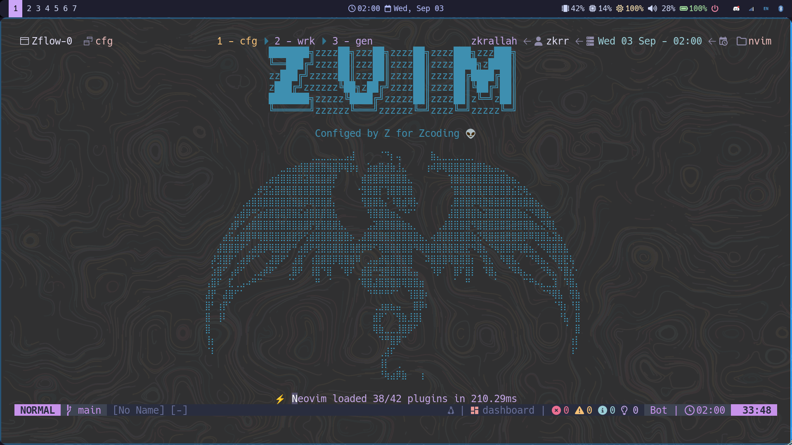
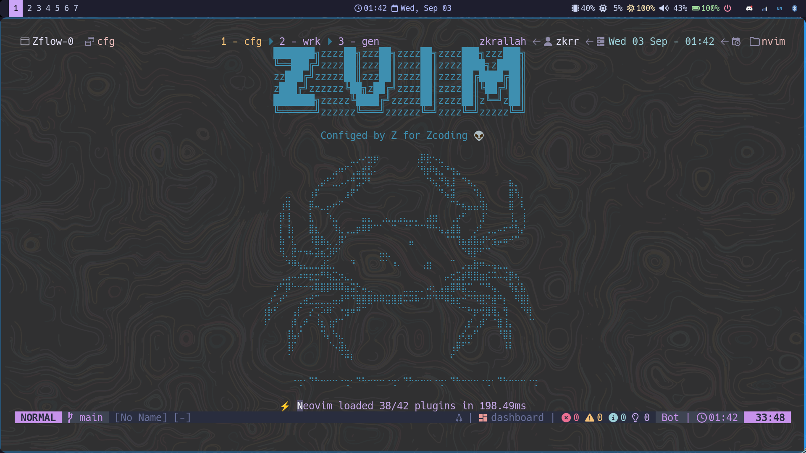
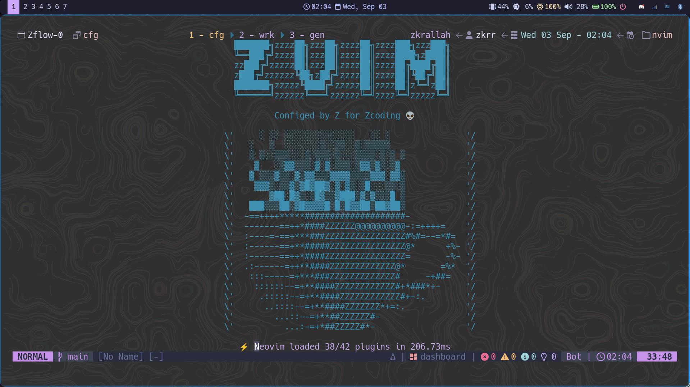
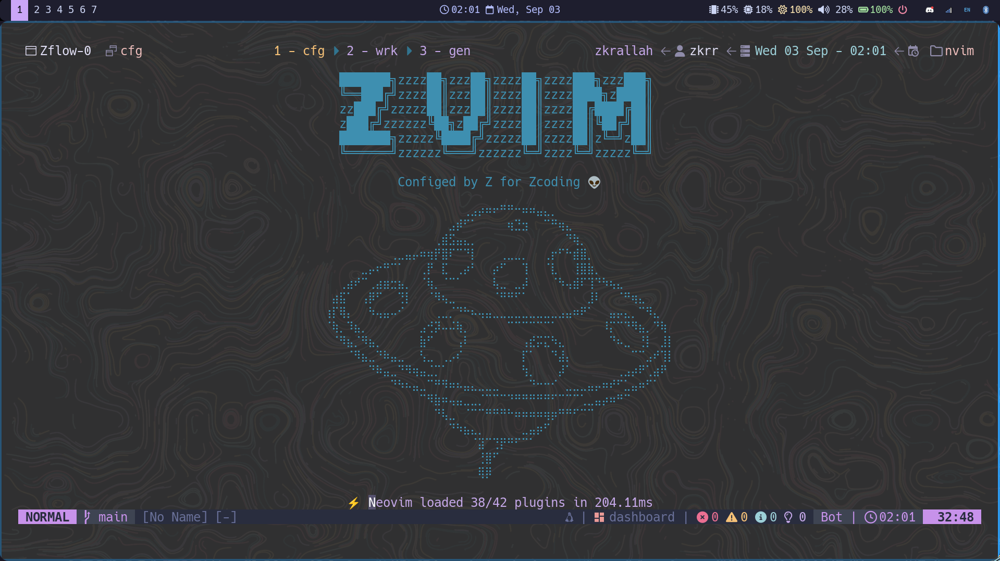
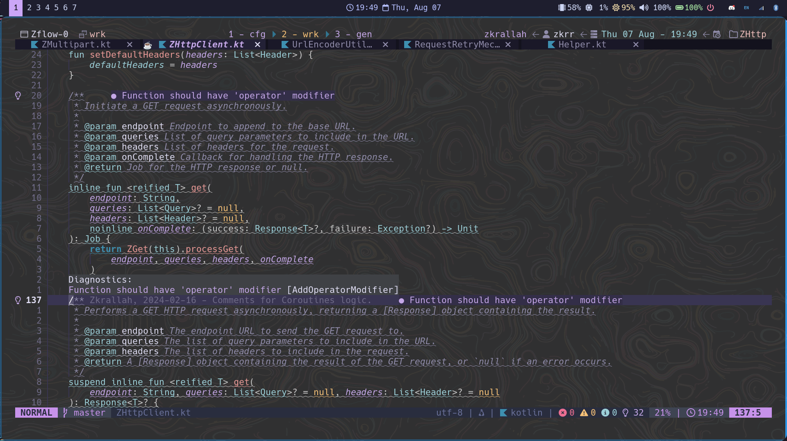
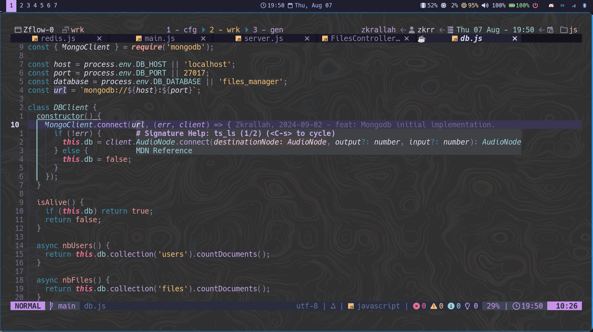
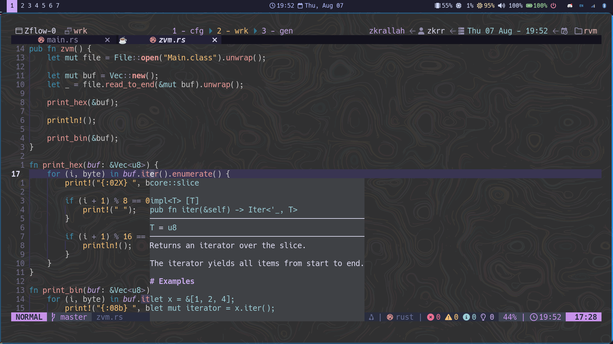

# ZVIM.NVIM

## Introduction

This is my personalized NeoVim configuration and main development environment. 🥷😈

I use this NeoVim config for writing Java/Kotlin, C/C++, Go, JavaScript, Python, Rust, lua, Markdown, bash, and pretty much every other file type (txt, conf, toml, yaml, yml, xml, gradle, etc). If it's a file, no matter what, I open it in NeoVim.

Even the terminal, I frequently open the terminal inside NeoVim to take advantage of Vim motions directly within terminal sessions.

This configuration was built from scratch using vanilla NeoVim. It’s tailored to my personal workflow and preferences, so some keymaps, motions, and configurations may not suit everyone. What makes so much sense to me might not make any sense to someone else and vice versa. That’s the whole point and the strength of NeoVim in the first place, customization for personal needs.

## Preview

### Dashboard

<table align="center">
  <tr>
    <td></td>
    <td></td>
    <td></td>
    <td></td>
    <td></td>
  </tr>
</table>

<!--  <hr> -->
### File Tree
 <hr>
### Code Completion Suggestions with Information and Signature
 <hr>
### Code Actions and Quick Fix Menu with Search
 <hr>
### Debugger
 <hr>
### Git Features and Files Analysis
 <hr>
### Errors/Warnings/Info/Hint Diagnostics
 <hr>
### Function Arguments Signature Help
 <hr>
### Hover for Info and Docs
 <hr>

As you can see from the screenshots, I can use this NeoVim setup with the same configs, motions, keymaps, workflow, and everything across different multiple languages and I don't have to install a dedicated IDE for each language or switch between different editors. This setup gives me complete freedom, maximum productivity, and full control over the development environment.

These screenshots represent only a small subset of the available features. Interactive capabilities like go to declaration, LSP rename, Vim motions, keymaps, and many more others can't be fully demonstrated in static images. While this setup offers everything you'd expect from a modern IDE, it also adds powerful features and customizations that go beyond what typical text editors or even full-featured IDEs like VS Code or IntelliJ provide.

# Installation
For Debian-based machines, you can run this bash script and it will automatically install all the prerequisites and required software to be able to operate NeoVim with my set of plugins, options, configurations, and keymaps. 👽🍃 <br>

First, create a new file on your Linux distro : 
```bash
touch zvim.sh
```

Copy this bash script into the file :
```bash
#!/bin/bash

# Add Neovim unstable PPA
sudo add-apt-repository -y ppa:neovim-ppa/unstable

# Update package lists
sudo apt-get update

# Install required packages
sudo apt-get install -y neovim
sudo apt-get install -y ripgrep
sudo apt-get install -y fzf
sudo apt-get install -y fd-find
sudo apt-get install -y lua5.3
sudo apt-get install -y nodejs npm
sudo apt-get install -y gcc
sudo apt-get install -y python3-pip
sudo apt-get install -y zip unzip

# Install pynvim for Python support
pip3 install pynvim

# Install Rust using rustup
curl --proto '=https' --tlsv1.2 -sSf https://sh.rustup.rs | sh -s -- -y

# Source cargo environment for Rust
source $HOME/.cargo/env

# Set up Neovim configuration directory
mkdir -p ~/.config/nvim

# Clone your Neovim setup directly into the target directory
git -C ~/.config/nvim clone https://github.com/muhammadzkralla/zvim.nvim.git zvim

# Move the contents of the cloned directory into ~/.config/nvim
mv ~/.config/nvim/zvim/* ~/.config/nvim/
rm -rf ~/.config/nvim/zvim

# Display success message
echo "#############################################"
echo "#                                           #"
echo "#         ZVIM SETUP COMPLETED! 🎉           #"
echo "#                                           #"
echo "#############################################"
echo "# You can now start Neovim with the command #"
echo "#               'nvim'                      #"
echo "#############################################"
```

> [!NOTE]
> This bash script installs the latest unstable version of NeoVim which is the fastest way to install NeoVim. However, I recommend cloning the official NeoVim repository and building it from source for a more stable experience.

Make it executable : 
```bash
chmod +x zvim.sh
```

Finally, run the bash script : 
```bash
./zvim.sh
```
