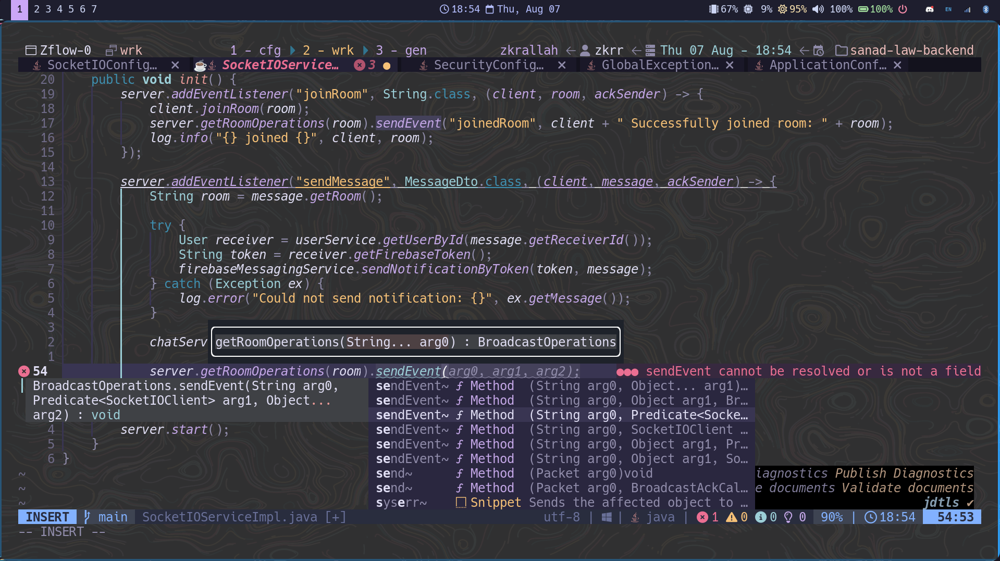

# ZVIM.NVIM

My customized NeoVim configuration and development environment. 🥷😈

 <hr>
 <hr>
 <hr>
 <hr>
 <hr>
 <hr>

# Installation
For Debian-based machines, you can run this bash script and it will automatically install all the prerequisites and required software to be able to operate NeoVim with my set of plugins, options, configurations, and keymaps. 👽🍃 <br>

First, create a new file on your Linux distro : 
```bash
touch zvim.sh
```

Copy this bash script into the file :
```bash
#!/bin/bash

# Add Neovim unstable PPA
sudo add-apt-repository -y ppa:neovim-ppa/unstable

# Update package lists
sudo apt-get update

# Install required packages
sudo apt-get install -y neovim
sudo apt-get install -y ripgrep
sudo apt-get install -y fzf
sudo apt-get install -y fd-find
sudo apt-get install -y lua5.3
sudo apt-get install -y nodejs npm
sudo apt-get install -y gcc
sudo apt-get install -y python3-pip
sudo apt-get install -y zip unzip

# Install pynvim for Python support
pip3 install pynvim

# Install Rust using rustup
curl --proto '=https' --tlsv1.2 -sSf https://sh.rustup.rs | sh -s -- -y

# Source cargo environment for Rust
source $HOME/.cargo/env

# Set up Neovim configuration directory
mkdir -p ~/.config/nvim

# Clone your Neovim setup directly into the target directory
git -C ~/.config/nvim clone https://github.com/muhammadzkralla/zvim.nvim.git zvim

# Move the contents of the cloned directory into ~/.config/nvim
mv ~/.config/nvim/zvim/* ~/.config/nvim/
rm -rf ~/.config/nvim/zvim

# Display success message
echo "#############################################"
echo "#                                           #"
echo "#         ZVIM SETUP COMPLETED! 🎉           #"
echo "#                                           #"
echo "#############################################"
echo "# You can now start Neovim with the command #"
echo "#               'nvim'                      #"
echo "#############################################"
```

Make it executable : 
```bash
chmod +x zvim.sh
```

Finally, run the bash script : 
```bash
./zvim.sh
```
